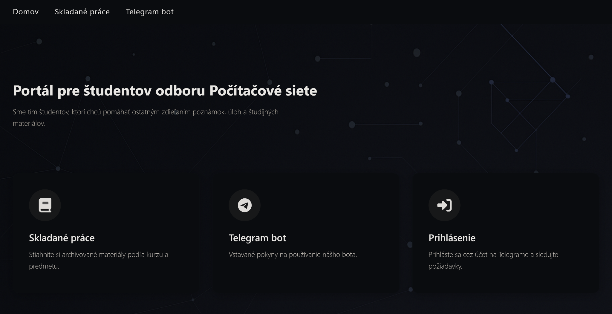

# 🧑‍💻 Networking Student Portal

A modern and dark-themed React-based web portal for students of the *Computer Networks* program. Built by students, for students — this project provides organized study materials, Telegram bot instructions, and Telegram-based authentication.

🔗 **Live demo**: [https://pocitacove-siete-portal.netlify.app](https://pocitacove-siete-portal.netlify.app)



## ✨ Features

- Organized downloadable academic materials by year and subject
- Built-in Telegram bot guide and usage instructions
- Telegram-based login for request tracking
- Responsive and elegant dark user interface
- Modern frontend setup using Vite + React

## 🛠️ Tech Stack

- React (with JSX and Hooks)
- Vite for fast development and builds
- CSS Modules and custom styling
- React Router for page navigation

## 📁 Project Structure

```
├── public/                        # Static assets
├── src/
│   ├── assets/                   # Images and graphics
│   ├── components/               # Reusable components (Navbar, ScrollToTop)
│   ├── pages/                    # Page components: Home, BotGuide, Works
│   ├── styles/                   # CSS files
│   ├── router/                   # Route configuration
│   ├── App.jsx, main.jsx         # Main entry points
├── index.html                    # HTML template
├── vite.config.js                # Vite config
├── package.json                  # Dependencies
├── README.md                     # Project documentation
```

## 🚀 How to Run Locally

```bash
git clone https://github.com/tetianamohorian/portal_networking.git
cd portal_networking
npm install
npm run dev
```

Then open `http://localhost:5173` in your browser.

## 🎯 Skills Demonstrated

- React-based SPA development
- Component-based UI architecture
- Dark-mode design and CSS layout
- Routing and navigation with React Router
- Hosting static sites on Netlify

## 📸 Screenshot


## 📚 License

This project is open-source and available under the MIT License.

## 👨‍💻 Author

Made with 💡 by [Your Name] — React developer and CS student at TUKE.
